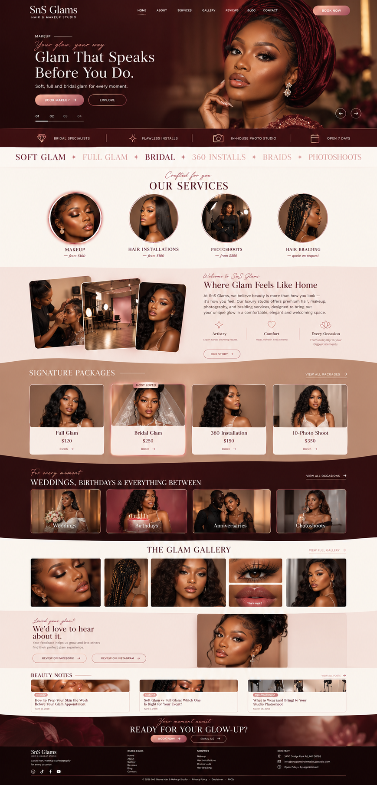
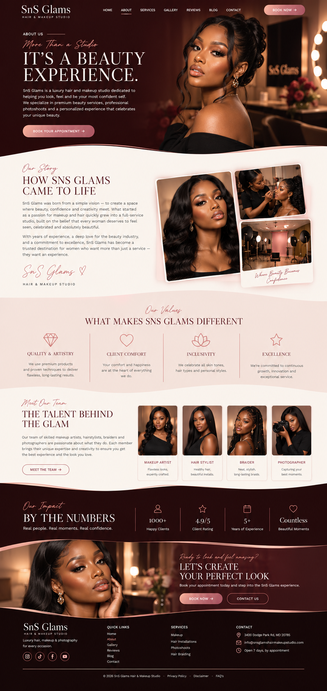
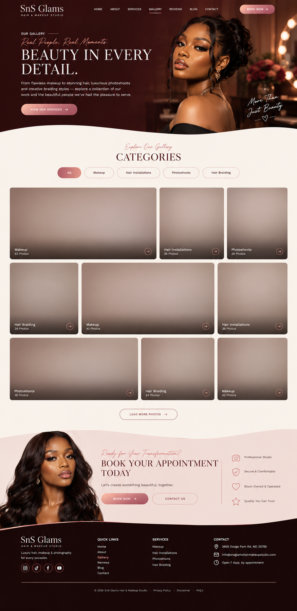
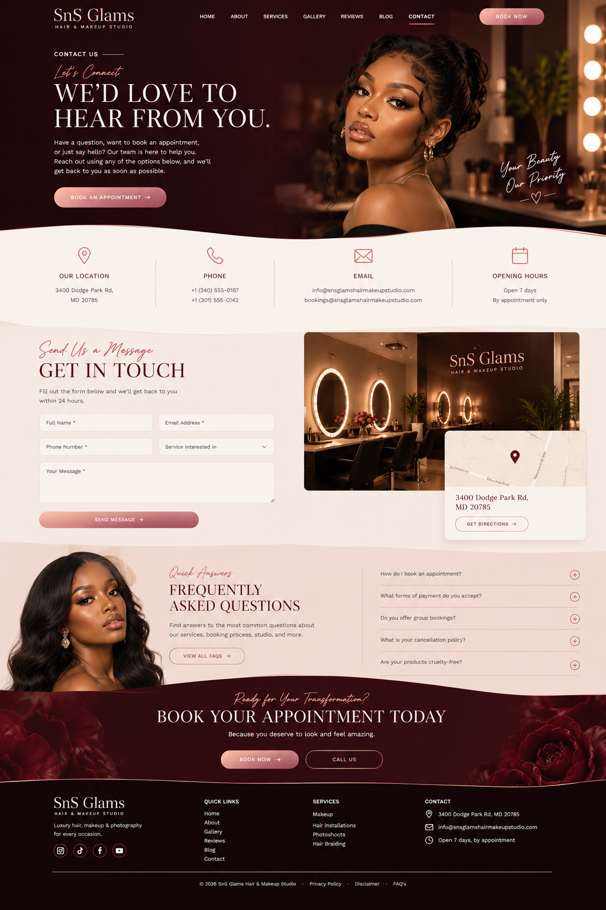

# SnS Glams — Hair, Makeup & Photo Studio

The website for **SnS Glams Hair & Makeup Studio**, a luxury beauty studio in Maryland offering makeup, hair installations, braiding and in-house studio photography.

It's a fast, server-rendered React site with an editorial look, a single site-wide booking flow and a scroll-driven 3D section on the home page. There is no database and no login. All content lives in typed data files, and enquiries go straight to the studio's inbox.



<table>
  <tr>
    <td></td>
    <td></td>
    <td></td>
  </tr>
</table>

---

## Contents

- [Features](#features)
- [Tech stack](#tech-stack)
- [Getting started](#getting-started)
- [Scripts](#scripts)
- [Environment variables](#environment-variables)
- [Project structure](#project-structure)
- [Pages](#pages)
- [Editing content](#editing-content)
- [How enquiries are delivered](#how-enquiries-are-delivered)
- [Deployment](#deployment)
- [Working with Lovable](#working-with-lovable)
- [Conventions](#conventions)

---

## Features

- **Editorial design system.** Burgundy, rose and cream tokens, Cormorant Garamond display type, Allura script accents and Jost body text, all defined in `src/styles.css` with Tailwind CSS v4.
- **One site-wide booking modal ("Get a Quote").** Any "Book" button can open it with a service and package already selected. It has field validation, venue and address handling, time-slot selection and a deposit acknowledgement.
- **Enquiry delivery that doesn't lose messages.** Forms try Web3Forms first, then FormSubmit, then fall back to a pre-filled `mailto:` link.
- **Scroll-driven 3D section.** A React Three Fiber scene on the home page that reacts to scroll position and respects `prefers-reduced-motion`.
- **Real studio work.** The gallery uses the studio's own photos, with 640px thumbnails and 1280px lightbox versions. A few Unsplash photos fill categories that don't have enough studio shots yet.
- **SEO on every route.** Each page sets its own title, description, Open Graph and Twitter tags, and pages are server-rendered.
- **Smooth motion.** Lenis smooth scrolling, Motion reveal animations, Ken Burns hero slides and a marquee.
- **Responsive and accessible.** Layouts are mobile-first. Dialogs move focus in on open, restore it on close and close on Escape, and icon controls have ARIA labels.

## Tech stack

| Area | Tools |
| --- | --- |
| Framework | [TanStack Start](https://tanstack.com/start) (React 19, SSR) with file-based [TanStack Router](https://tanstack.com/router) |
| Build | Vite 8, Nitro (Node server output) |
| Styling | Tailwind CSS v4, shadcn/ui on Radix UI primitives, `tw-animate-css` |
| Motion & 3D | Motion, Lenis, Three.js, `@react-three/fiber`, `@react-three/drei` |
| UI bits | Embla Carousel, Lucide icons, Sonner toasts |
| Quality | TypeScript, ESLint, Prettier |

## Getting started

**Prerequisites:** Node.js 22 or newer and npm. Bun works too, since `bun.lock` is kept in sync.

```sh
git clone https://github.com/ojrandy/sns-glam.git
cd sns-glam
npm install
cp .env.example .env   # optional, see "Environment variables"
npm run dev
```

The dev server prints its local URL in the terminal.

## Scripts

| Command | What it does |
| --- | --- |
| `npm run dev` | Starts the Vite dev server with hot reload |
| `npm run build` | Builds for production into `.output/` |
| `npm run build:dev` | Builds in development mode |
| `npm run preview` | Previews the production build through Vite |
| `npm start` | Runs the built Node server (`node .output/server/index.mjs`) |
| `npm run lint` | Runs ESLint |
| `npm run format` | Formats the codebase with Prettier |

## Environment variables

Copy `.env.example` to `.env`. The `.env` file is gitignored.

| Variable | Required | Purpose |
| --- | --- | --- |
| `VITE_WEB3FORMS_ACCESS_KEY` | No | A free [Web3Forms](https://web3forms.com) access key. Register it with `info@snsglamshairmakeupstudio.com` so submissions land in the studio inbox. If it's empty, forms fall back to FormSubmit and then to `mailto:`. |

> [!NOTE]
> Anything prefixed with `VITE_` is compiled into the client bundle, so it is public. Web3Forms access keys are designed to be public. Never put private secrets in a `VITE_` variable.

## Project structure

```
.
├── public/                  # Static files served as-is (favicon, robots.txt)
├── UI/                      # Screenshots used in this README
├── src/
│   ├── routes/              # File-based routes (one file per URL)
│   │   ├── __root.tsx       # HTML shell, global <head>, fonts, error & 404 pages
│   │   ├── index.tsx        # Home page
│   │   ├── services.*.tsx   # Services layout, index and one route per service
│   │   ├── blog.*.tsx       # Journal layout, index and post pages
│   │   └── ...              # about, gallery, bookings, contact, faq, reviews, legal
│   ├── components/
│   │   ├── site-shell.tsx   # Header, navigation, footer, smooth-scroll wrapper
│   │   ├── booking.tsx      # BookingProvider + the global "Get a Quote" modal
│   │   ├── editorial.tsx    # Shared blocks: Reveal, BookButton, CTABanner, Curve...
│   │   ├── pages.tsx        # Page bodies for the content routes
│   │   ├── gallery-page.tsx # Filterable gallery with lightbox
│   │   ├── beauty-motion.tsx# Scroll-driven 3D scene (React Three Fiber)
│   │   └── ui/              # shadcn/ui components
│   ├── data/                # All site content, see "Editing content"
│   ├── lib/
│   │   ├── send-enquiry.ts  # Web3Forms, then FormSubmit, then mailto delivery
│   │   └── ...              # Error capture/reporting, utils
│   ├── assets/              # Optimised gallery images, stock photos, logos
│   ├── Images/              # Original studio photos
│   ├── Graphics/            # Brand graphics (logo, palette, social artwork)
│   ├── router.tsx           # Router setup
│   ├── server.ts            # SSR entry with error wrapper
│   └── styles.css           # Tailwind v4 theme, design tokens and utilities
├── vite.config.ts           # Lovable TanStack config, Nitro node-server preset
└── AGENTS.md                # Guidelines for AI coding agents
```

## Pages

| URL | Page |
| --- | --- |
| `/` | Home: hero carousel, services, about, 3D motion section, packages, occasions, gallery, reviews, journal, CTA |
| `/services` | All services and packages |
| `/services/makeup` | Soft glam, full glam and bridal makeup |
| `/services/hair-installations` | Installs, 360 installs and bridal hair |
| `/services/photoshoots` | In-studio photoshoot packages |
| `/services/hair-braiding` | Braiding through partner studio Heritage African Hair Braiding |
| `/gallery` | Filterable portfolio with lightbox |
| `/bookings` | Booking page |
| `/about`, `/faq`, `/reviews`, `/contact` | Studio information and contact form |
| `/blog`, `/blog/:slug` | Beauty journal |
| `/privacy-policy`, `/disclaimer` | Legal pages |

Anything else renders the branded 404 page.

## Editing content

Most copy, prices and images live in `src/data/`, so most updates don't need changes to components.

| File | What it controls |
| --- | --- |
| `site.ts` | Studio name, address, map embed, email, phone, hours, social links |
| `services.ts` | Services, packages and prices, per-service page copy (intro, highlights, process, prep tips, FAQs), and the featured packages on the home page |
| `gallery.ts` | Gallery images, categories and alt text |
| `media.ts` | Named images reused across pages |
| `posts.ts` | Journal articles |
| `reviews.ts` | Client reviews. It's empty until verified reviews are added, and the site shows a "leave a review" prompt meanwhile. |

A few rules to follow:

- **Package names must match exactly.** The booking modal preselects packages by `name`, so a featured package's `name` must match a package in `services`.
- **Adding gallery photos:** put a 640px `name.jpg` and a 1280px `name-lg.jpg` in `src/assets/gallery/`, then reference `name` in `gallery.ts`. Missing files fail the build on purpose, so broken images are caught early.
- **Always add `alt` text** to new images.

## How enquiries are delivered

The booking modal and the contact form both call `sendEnquiry()` in `src/lib/send-enquiry.ts`. It tries each channel in order and stops at the first one that succeeds:

1. **Web3Forms.** Used only when `VITE_WEB3FORMS_ACCESS_KEY` is set.
2. **FormSubmit.** Posts to `site.email` and needs no key. The first submission sends a one-time activation email to the studio inbox, which has to be confirmed.
3. **`mailto:`.** Opens the visitor's email app with the enquiry pre-filled, so nothing is lost.

A hidden honeypot field (`botcheck`) quietly drops bot submissions.

## Deployment

`vite.config.ts` uses Nitro's `node-server` preset, so the build is a standalone Node server. That suits hosts like Hostinger Node.js hosting, a VPS or Render.

```sh
npm ci
npm run build
npm start        # serves on PORT (defaults to 3000)
```

Only `.output/` is needed at runtime. Put it behind your host's process manager (for example PM2) and set `PORT` if needed.

Builds run inside Lovable ignore the Node preset and keep Lovable's own Cloudflare target, so both deployment paths work.

## Working with Lovable

This project is connected to [Lovable](https://lovable.dev/projects/fc6d4591-1e8c-4f23-bc4e-9b467ccdcc88). Changes made in the Lovable editor are committed to `main`, and changes pushed to `main` sync back into Lovable.

> [!IMPORTANT]
> Don't rewrite published git history (no force pushes or rebases of `main`). Pull before you push, and merge if the branches have diverged.

## Conventions

- Keep public content in `src/data` and render it through shared components, so prices and brand details stay consistent.
- Use one global booking modal under `BookingProvider`. Every booking button passes an optional service or package to preselect.
- Routes are TanStack file routes. `src/routeTree.gen.ts` is generated automatically, so don't edit it by hand. See `src/routes/README.md` for naming.
- Don't add plugins that `@lovable.dev/vite-tanstack-config` already includes, such as React, Tailwind or tsconfig paths. Duplicates break the build.

---

© SnS Glams Hair & Makeup Studio · 3400 Dodge Park Rd, MD 20785 · [info@snsglamshairmakeupstudio.com](mailto:info@snsglamshairmakeupstudio.com)
